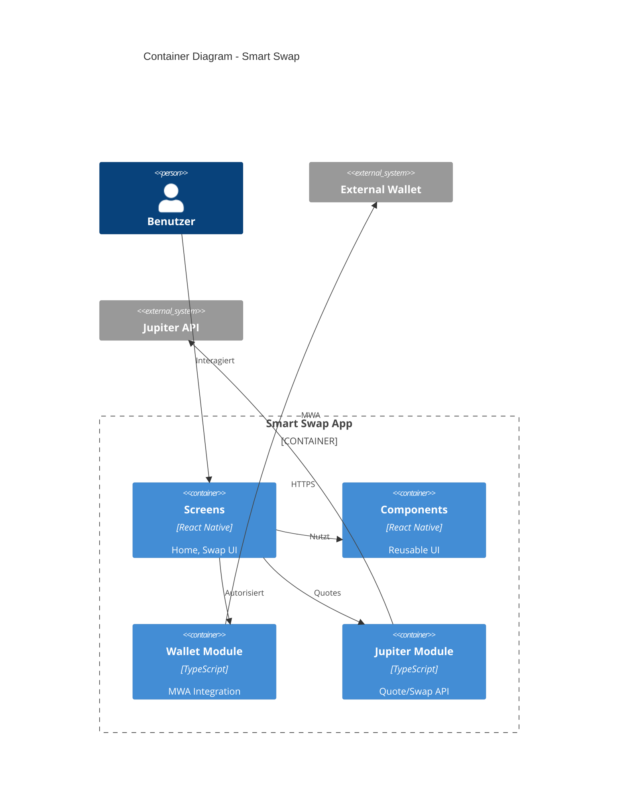

# Component Diagram

## C4 Level 2: Container View



## Modul-Struktur

```
app/
├── screens/                    # UI Layer
│   ├── Home.tsx               # Wallet Connection
│   └── Swap.tsx               # Quote & Swap Execution
│
├── components/                 # Shared Components
│   ├── Button.tsx             # Action Buttons
│   ├── TokenInput.tsx         # Amount Input
│   └── QuoteDisplay.tsx       # Quote Visualization
│
├── wallet/                     # Wallet Domain
│   ├── wallet.ts              # Wallet Export (Mock/Real Toggle)
│   ├── mwaWallet.ts           # MWA Implementation
│   └── mockWallet.ts          # Development Mock
│
├── jupiter/                    # Jupiter Domain
│   ├── quote.ts               # Quote API
│   └── swap.ts                # Swap Transaction Builder
│
├── polyfills.ts               # Platform Compatibility
└── app.tsx                    # App Entry Point
```

## Abhängigkeiten

```
┌─────────────────────────────────────────────────────────┐
│                      screens/                           │
│  ┌─────────────┐              ┌─────────────┐          │
│  │   Home.tsx  │              │  Swap.tsx   │          │
│  └──────┬──────┘              └──────┬──────┘          │
│         │                            │                  │
│         │         ┌──────────────────┤                  │
│         │         │                  │                  │
│         ▼         ▼                  ▼                  │
│  ┌─────────────────────┐    ┌─────────────────────┐    │
│  │   components/       │    │    wallet/          │    │
│  │   Button, Input     │    │    wallet.ts        │    │
│  └─────────────────────┘    └──────────┬──────────┘    │
│                                        │               │
│                              ┌─────────┴─────────┐     │
│                              │                   │     │
│                              ▼                   ▼     │
│                      ┌────────────┐      ┌────────────┐│
│                      │mwaWallet.ts│      │mockWallet  ││
│                      └────────────┘      └────────────┘│
└─────────────────────────────────────────────────────────┘
                              │
                              ▼
┌─────────────────────────────────────────────────────────┐
│              External Dependencies                      │
│  ┌─────────────────────────────────────────────────┐   │
│  │  @solana-mobile/mobile-wallet-adapter-protocol  │   │
│  └─────────────────────────────────────────────────┘   │
│  ┌─────────────────────────────────────────────────┐   │
│  │  @solana/web3.js                                │   │
│  └─────────────────────────────────────────────────┘   │
└─────────────────────────────────────────────────────────┘
```

## Module Responsibilities

| Modul | Verantwortung | Abhängigkeiten |
|-------|---------------|----------------|
| `screens/Home` | Wallet-Verbindung initiieren | wallet, components |
| `screens/Swap` | Quote anzeigen, Swap ausführen | wallet, jupiter, components |
| `wallet/wallet` | Wallet-Instanz bereitstellen | mwaWallet oder mockWallet |
| `wallet/mwaWallet` | MWA Protocol Implementation | @solana-mobile/... |
| `jupiter/quote` | Quotes von Jupiter abrufen | fetch API |
| `jupiter/swap` | Swap-Transactions erstellen | @solana/web3.js |
