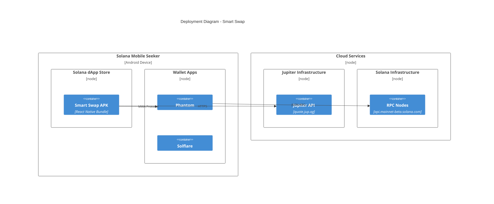

# Deployment Diagram

## Infrastructure Overview



## Deployment Architecture (ASCII)

```
┌─────────────────────────────────────────────────────────────────────────┐
│                        Solana Mobile Seeker                             │
│  ┌───────────────────────────────────────────────────────────────────┐ │
│  │                     Solana dApp Store                              │ │
│  │  ┌─────────────────────────────────────────────────────────────┐  │ │
│  │  │                   Smart Swap v1.0.0                          │  │ │
│  │  │  ┌─────────────────────────────────────────────────────┐    │  │ │
│  │  │  │              React Native Bundle                     │    │  │ │
│  │  │  │  • Home Screen      • Swap Screen                   │    │  │ │
│  │  │  │  • Wallet Module    • Jupiter Module                │    │  │ │
│  │  │  └─────────────────────────────────────────────────────┘    │  │ │
│  │  │  ┌─────────────────────────────────────────────────────┐    │  │ │
│  │  │  │              Native Libraries                        │    │  │ │
│  │  │  │  • MWA Protocol Client                              │    │  │ │
│  │  │  │  • React Native Bridge                              │    │  │ │
│  │  │  └─────────────────────────────────────────────────────┘    │  │ │
│  │  └─────────────────────────────────────────────────────────────┘  │ │
│  └───────────────────────────────────────────────────────────────────┘ │
│                                    │                                    │
│                                    │ MWA Protocol                       │
│                                    ▼                                    │
│  ┌───────────────────────────────────────────────────────────────────┐ │
│  │                        Wallet Apps                                 │ │
│  │  ┌─────────────┐  ┌─────────────┐  ┌─────────────┐               │ │
│  │  │   Phantom   │  │  Solflare   │  │   Ultimate  │               │ │
│  │  │   Wallet    │  │   Wallet    │  │   Wallet    │               │ │
│  │  └─────────────┘  └─────────────┘  └─────────────┘               │ │
│  └───────────────────────────────────────────────────────────────────┘ │
└─────────────────────────────────────────────────────────────────────────┘
                    │                              │
                    │ HTTPS                        │ JSON-RPC
                    ▼                              ▼
┌─────────────────────────────────────────────────────────────────────────┐
│                          Cloud Infrastructure                           │
│                                                                         │
│  ┌─────────────────────────────┐  ┌─────────────────────────────────┐  │
│  │      Jupiter API            │  │      Solana Mainnet             │  │
│  │  ┌───────────────────────┐  │  │  ┌───────────────────────────┐  │  │
│  │  │   quote.jup.ag        │  │  │  │   RPC Nodes               │  │  │
│  │  │   • /quote            │  │  │  │   • api.mainnet-beta      │  │  │
│  │  │   • /swap             │  │  │  │   • Custom RPC (optional) │  │  │
│  │  └───────────────────────┘  │  │  └───────────────────────────┘  │  │
│  └─────────────────────────────┘  └─────────────────────────────────┘  │
└─────────────────────────────────────────────────────────────────────────┘
```

## Build & Distribution Pipeline

```
┌──────────────────────────────────────────────────────────────────────────┐
│                           Build Pipeline                                 │
│                                                                          │
│  ┌──────────┐    ┌──────────┐    ┌──────────┐    ┌──────────────────┐   │
│  │  Source  │───>│   EAS    │───>│  Signed  │───>│  Solana dApp     │   │
│  │   Code   │    │  Build   │    │   APK    │    │  Store Publish   │   │
│  └──────────┘    └──────────┘    └──────────┘    └──────────────────┘   │
│       │               │               │                   │              │
│       │               │               │                   │              │
│       ▼               ▼               ▼                   ▼              │
│  ┌──────────┐    ┌──────────┐    ┌──────────┐    ┌──────────────────┐   │
│  │ app.json │    │ Android  │    │ Release  │    │ Publisher NFT    │   │
│  │ eas.json │    │ Keystore │    │ Keystore │    │ App NFT          │   │
│  │ config   │    │ (EAS)    │    │ Signed   │    │ Release NFT      │   │
│  └──────────┘    └──────────┘    └──────────┘    └──────────────────┘   │
│                                                                          │
└──────────────────────────────────────────────────────────────────────────┘
```

## Environment Configuration

| Environment | Beschreibung | Build Profile |
|-------------|--------------|---------------|
| Development | Lokales Testing mit Mock Wallet | `development` |
| Preview | Internal Testing auf echtem Device | `preview` |
| Production | dApp Store Release | `dapp-store` |

## Endpoints

| Service | URL | Verwendung |
|---------|-----|------------|
| Jupiter Quote | `https://quote-api.jup.ag/v6/quote` | Swap Quotes |
| Jupiter Swap | `https://quote-api.jup.ag/v6/swap` | Transaction Creation |
| Solana RPC | `https://api.mainnet-beta.solana.com` | Transaction Submission |

## APK Signing

```
┌───────────────────────────────────────────────────────────┐
│                    Signing Configuration                  │
├───────────────────────────────────────────────────────────┤
│                                                           │
│  Development:                                             │
│  └─ Debug Keystore (auto-generated by EAS)               │
│                                                           │
│  dApp Store Release:                                      │
│  └─ Production Keystore                                   │
│     • Managed by EAS Credentials                          │
│     • SEPARATE from Google Play keystore                  │
│     • Stored securely in Expo servers                     │
│                                                           │
│  IMPORTANT:                                               │
│  ┌─────────────────────────────────────────────────────┐ │
│  │ dApp Store does NOT accept APKs signed with         │ │
│  │ Google Play App Signing keys!                       │ │
│  └─────────────────────────────────────────────────────┘ │
│                                                           │
└───────────────────────────────────────────────────────────┘
```

## NFT-Based Publishing

```
┌────────────────────────────────────────────────────────────────────┐
│                 Solana dApp Store NFT Structure                    │
├────────────────────────────────────────────────────────────────────┤
│                                                                    │
│  Publisher NFT                                                     │
│  └─ Owned by: Your Solana Wallet                                  │
│  └─ Contains: Publisher metadata (name, website, email)           │
│       │                                                            │
│       └──> App NFT                                                 │
│            └─ Contains: App metadata (name, description, icon)    │
│                 │                                                  │
│                 └──> Release NFT (v1.0.0)                         │
│                      └─ Contains: APK hash, release notes         │
│                      └─ Points to: APK download URL               │
│                                                                    │
│                 └──> Release NFT (v1.1.0)  [future]               │
│                      └─ ...                                        │
│                                                                    │
└────────────────────────────────────────────────────────────────────┘
```
