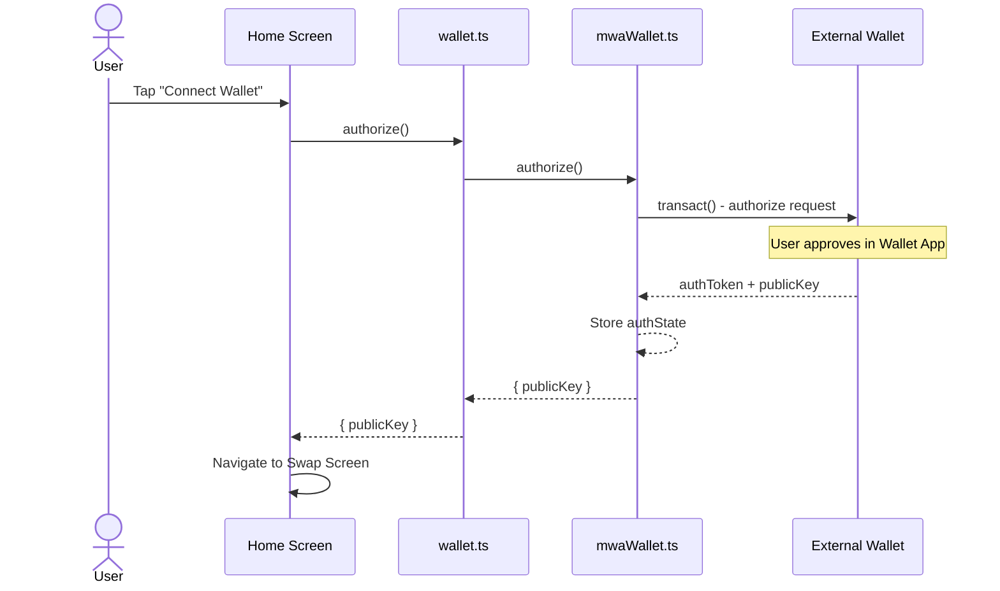
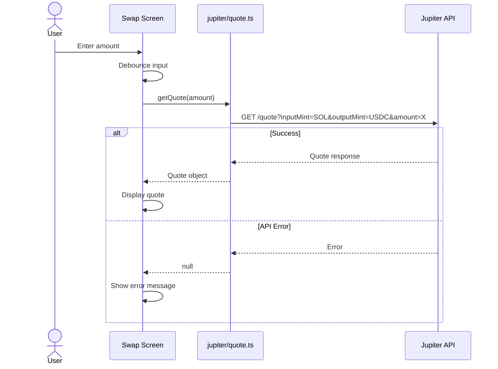
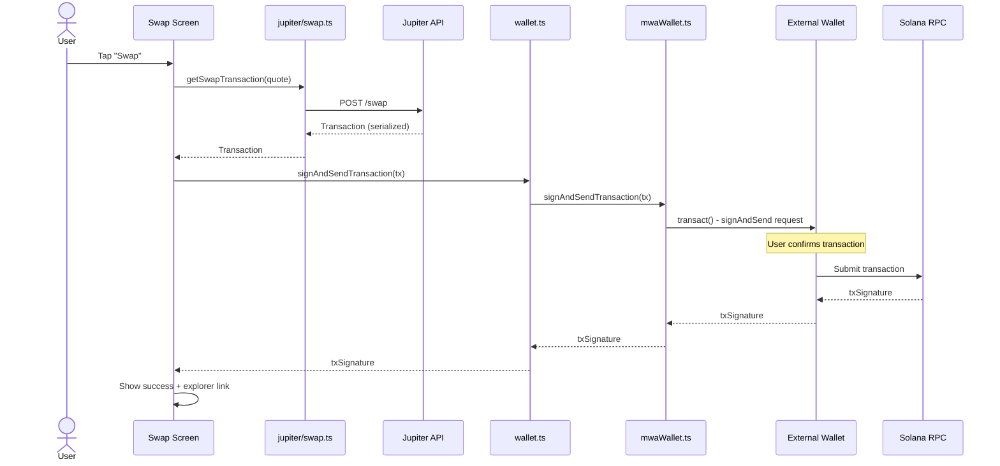
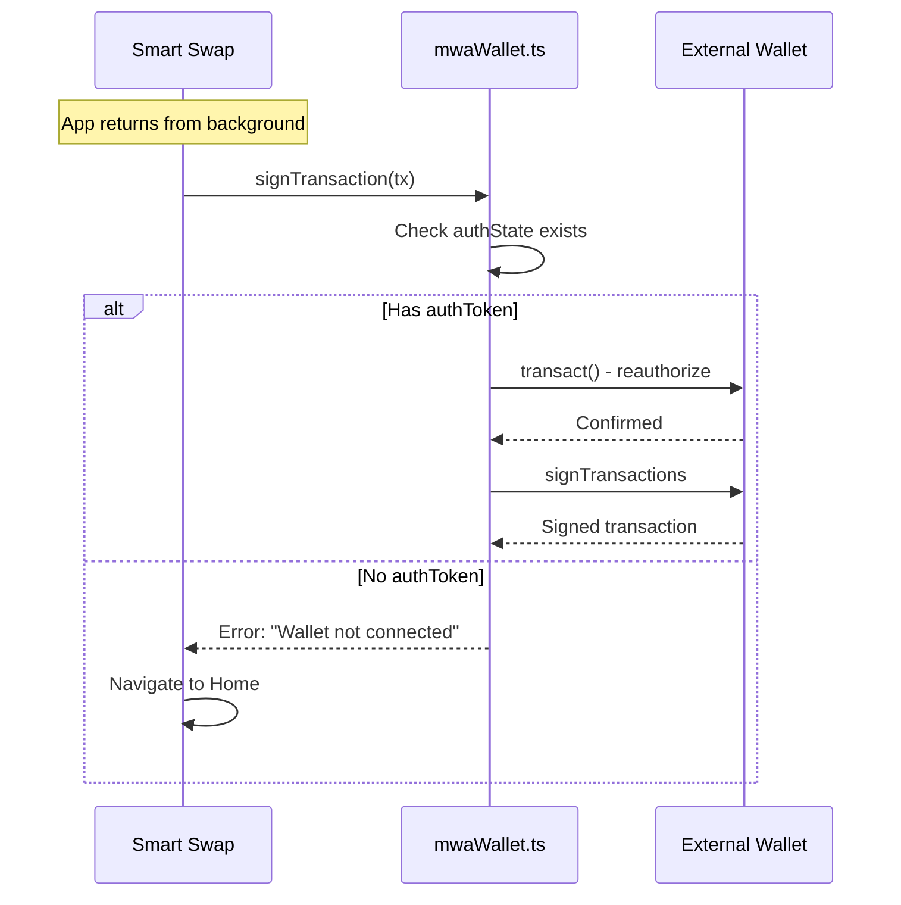
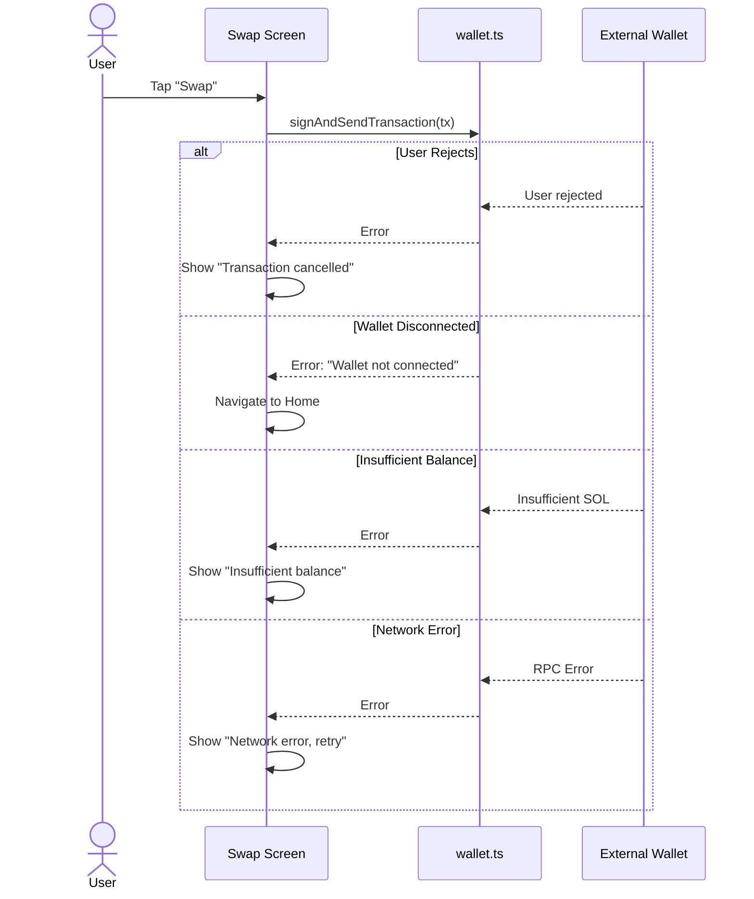

# Sequence Diagrams

## 1. Wallet Connection Flow



## 2. Quote Request Flow



## 3. Swap Execution Flow



## 4. Reauthorization Flow



## 5. Error Handling Flow



## ASCII Sequence: Complete Swap Journey

```
User          Home         Swap         Jupiter      Wallet       Solana
 │             │            │             │            │            │
 │──Connect───>│            │             │            │            │
 │             │──authorize────────────────────────────>│            │
 │             │            │             │            │──approve──>│
 │             │<───────────authToken + pubkey─────────│            │
 │<──Navigate──│            │             │            │            │
 │             │            │             │            │            │
 │──Enter Amt─────────────->│             │            │            │
 │             │            │──getQuote──>│            │            │
 │             │            │<───quote────│            │            │
 │<─────────Show Quote──────│             │            │            │
 │             │            │             │            │            │
 │──Tap Swap──────────────->│             │            │            │
 │             │            │──getSwapTx─>│            │            │
 │             │            │<────tx──────│            │            │
 │             │            │──signSend───────────────>│            │
 │             │            │             │            │──submit───>│
 │             │            │             │            │<──txSig────│
 │             │            │<────────────txSig────────│            │
 │<─────────Success─────────│             │            │            │
 │             │            │             │            │            │
```
