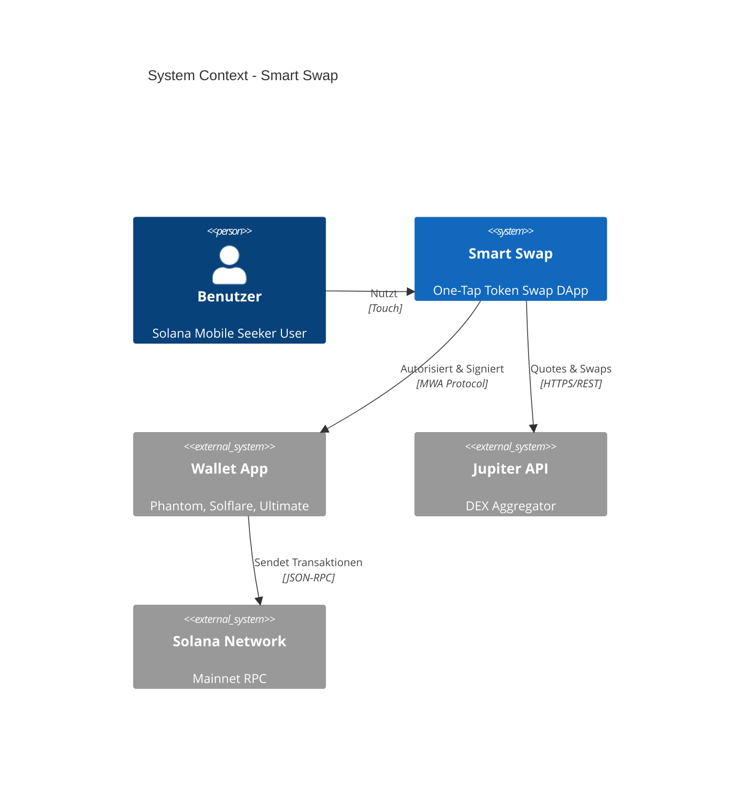

# System Context Diagram

## C4 Level 1: System Context



## Vereinfachte Darstellung (ASCII)

```
                    ┌─────────────────┐
                    │    Benutzer     │
                    │  (Seeker User)  │
                    └────────┬────────┘
                             │
                             ▼
┌────────────────────────────────────────────────────────────┐
│                      Smart Swap App                        │
│                                                            │
│  • Wallet Connection    • Quote Display    • Swap UI      │
└────────────────────────────────────────────────────────────┘
         │                      │                    │
         │ MWA                  │ REST              │
         ▼                      ▼                    │
┌─────────────────┐    ┌─────────────────┐          │
│   Wallet App    │    │   Jupiter API   │          │
│  (Phantom etc.) │    │  quote.jup.ag   │          │
└────────┬────────┘    └─────────────────┘          │
         │                                           │
         │ JSON-RPC                                  │
         ▼                                           │
┌─────────────────────────────────────────────────────┐
│              Solana Network (Mainnet)               │
└─────────────────────────────────────────────────────┘
```

## Schnittstellen

| Von | Nach | Protokoll | Daten |
|-----|------|-----------|-------|
| User | Smart Swap | Touch/UI | Amounts, Tap Events |
| Smart Swap | Wallet | MWA | Auth Requests, Transactions |
| Smart Swap | Jupiter | HTTPS | Quote Requests |
| Wallet | Solana | JSON-RPC | Signed Transactions |
